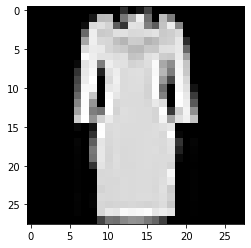
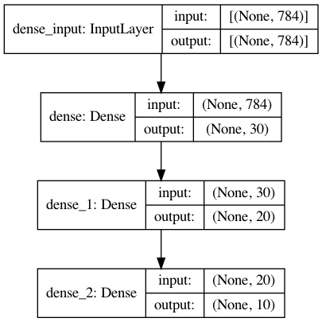

## Loading library

*Tensor Flow* library is a requirement to Keras. To install it do: `pip3 install tensorflow`.


```python
import tensorflow as tf
from tensorflow import keras
```


```python
keras.__version__
```


    '2.5.0'


## Loading dataset using Pandas


```python
import pandas as pd
```


```python
data_train_file = 'data/fashion-mnist_train.csv'
data_test_file = 'data/fashion-mnist_test.csv'

# this method returns a pandas DataFrame object "pandas.core.frame.DataFrame"
data_train = pd.read_csv(data_train_file)
data_test = pd.read_csv(data_test_file)

print(data_train.shape)
data_train.head()

```

    (60000, 785)


<div>
<style scoped>
    .dataframe tbody tr th:only-of-type {
        vertical-align: middle;
    }

    .dataframe tbody tr th {
        vertical-align: top;
    }

    .dataframe thead th {
        text-align: right;
    }
</style>
<table border="1" class="dataframe">
  <thead>
    <tr style="text-align: right;">
      <th></th>
      <th>label</th>
      <th>pixel1</th>
      <th>pixel2</th>
      <th>pixel3</th>
      <th>pixel4</th>
      <th>pixel5</th>
      <th>pixel6</th>
      <th>pixel7</th>
      <th>pixel8</th>
      <th>pixel9</th>
      <th>...</th>
      <th>pixel775</th>
      <th>pixel776</th>
      <th>pixel777</th>
      <th>pixel778</th>
      <th>pixel779</th>
      <th>pixel780</th>
      <th>pixel781</th>
      <th>pixel782</th>
      <th>pixel783</th>
      <th>pixel784</th>
    </tr>
  </thead>
  <tbody>
    <tr>
      <th>0</th>
      <td>2</td>
      <td>0</td>
      <td>0</td>
      <td>0</td>
      <td>0</td>
      <td>0</td>
      <td>0</td>
      <td>0</td>
      <td>0</td>
      <td>0</td>
      <td>...</td>
      <td>0</td>
      <td>0</td>
      <td>0</td>
      <td>0</td>
      <td>0</td>
      <td>0</td>
      <td>0</td>
      <td>0</td>
      <td>0</td>
      <td>0</td>
    </tr>
    <tr>
      <th>1</th>
      <td>9</td>
      <td>0</td>
      <td>0</td>
      <td>0</td>
      <td>0</td>
      <td>0</td>
      <td>0</td>
      <td>0</td>
      <td>0</td>
      <td>0</td>
      <td>...</td>
      <td>0</td>
      <td>0</td>
      <td>0</td>
      <td>0</td>
      <td>0</td>
      <td>0</td>
      <td>0</td>
      <td>0</td>
      <td>0</td>
      <td>0</td>
    </tr>
    <tr>
      <th>2</th>
      <td>6</td>
      <td>0</td>
      <td>0</td>
      <td>0</td>
      <td>0</td>
      <td>0</td>
      <td>0</td>
      <td>0</td>
      <td>5</td>
      <td>0</td>
      <td>...</td>
      <td>0</td>
      <td>0</td>
      <td>0</td>
      <td>30</td>
      <td>43</td>
      <td>0</td>
      <td>0</td>
      <td>0</td>
      <td>0</td>
      <td>0</td>
    </tr>
    <tr>
      <th>3</th>
      <td>0</td>
      <td>0</td>
      <td>0</td>
      <td>0</td>
      <td>1</td>
      <td>2</td>
      <td>0</td>
      <td>0</td>
      <td>0</td>
      <td>0</td>
      <td>...</td>
      <td>3</td>
      <td>0</td>
      <td>0</td>
      <td>0</td>
      <td>0</td>
      <td>1</td>
      <td>0</td>
      <td>0</td>
      <td>0</td>
      <td>0</td>
    </tr>
    <tr>
      <th>4</th>
      <td>3</td>
      <td>0</td>
      <td>0</td>
      <td>0</td>
      <td>0</td>
      <td>0</td>
      <td>0</td>
      <td>0</td>
      <td>0</td>
      <td>0</td>
      <td>...</td>
      <td>0</td>
      <td>0</td>
      <td>0</td>
      <td>0</td>
      <td>0</td>
      <td>0</td>
      <td>0</td>
      <td>0</td>
      <td>0</td>
      <td>0</td>
    </tr>
  </tbody>
</table>
<p>5 rows × 785 columns</p>
</div>


## Treating data


```python
# This function slices a panda data frame into two arrays. The first with labels and the other with
# all samples and their features - one by line. 
def treat_raw_data_frame(data_frame):
    # data is normalized to the max valua a pixel can take (255) - Gray Scale
    # each sample is a 28x28 array serialized
    features = data_frame.values[:, 1:]/255

    labels = data_frame.label.values

    # transforming labels to "one-hot" format
    labels = tf.keras.utils.to_categorical(labels)
    return labels, features

train_labels, train_features = treat_raw_data_frame(data_train)
test_labels, test_features = treat_raw_data_frame(data_test)

print("Shape of trainning feature dataset: {}".format(train_features.shape))
print("Shape of trainning labels dataset: {}".format(train_labels.shape))
```

    Shape of trainning feature dataset: (60000, 784)
    Shape of trainning labels dataset: (60000, 10)


```python
train_features[0, 90:110]
```


    array([0.        , 0.        , 0.        , 0.        , 0.24313725,
           0.23921569, 0.08235294, 0.11372549, 0.09019608, 0.2       ,
           0.53333333, 0.23921569, 0.        , 0.        , 0.        ,
           0.        , 0.        , 0.        , 0.        , 0.        ])


## Visualizing samples using matplotlib


```python
import numpy as np
import matplotlib.pyplot as plt
%matplotlib inline

# This functions plots a sample rechape array into a 28x28 2 dimensional array
def plot(data_set, index):
    plt.figure()
    plt.imshow(np.reshape(data_set[index, :], (28,28)), "gray")

plot(train_features, 4)
```


    

    


## Designing the Model


```python
# Define a sequential model. This defines the way Keras will generate a model. Keras has three different
# type of models: sequential, functional and subclassing [3].
model = tf.keras.Sequential()

# Two hidden layers, activation function is rectified linear unit
# all activation functions can be found at [4]
model.add(tf.keras.layers.Dense(30, activation=tf.nn.relu, input_shape=(784,)))
model.add(tf.keras.layers.Dense(20, activation=tf.nn.relu))

# Output layer
model.add(tf.keras.layers.Dense(10, activation=tf.nn.softmax))

# Keras provides resource for plotting the Neural Network architecture and parameters.
tf.keras.utils.plot_model(model, to_file="model.png", show_shapes=True)
```

    2021-07-13 21:30:31.711286: I tensorflow/core/platform/cpu_feature_guard.cc:142] This TensorFlow binary is optimized with oneAPI Deep Neural Network Library (oneDNN) to use the following CPU instructions in performance-critical operations:  AVX2 FMA
    To enable them in other operations, rebuild TensorFlow with the appropriate compiler flags.


    

    


## References

1. https://www.tensorflow.org/guide/keras
1. https://www.kaggle.com/zalando-research/fashionmnist
1. https://keras.io/api/models/
1. https://keras.io/api/layers/activations/


```python

```
